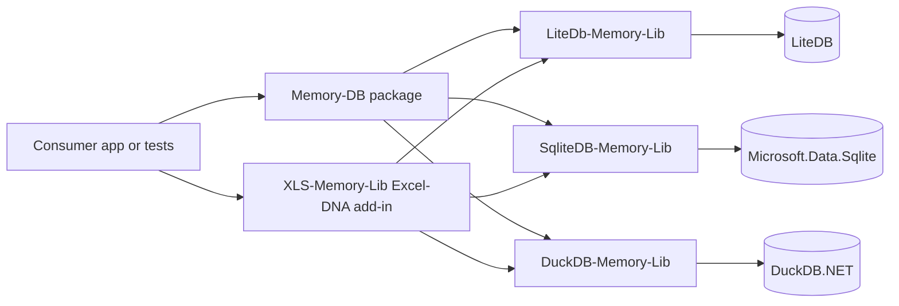
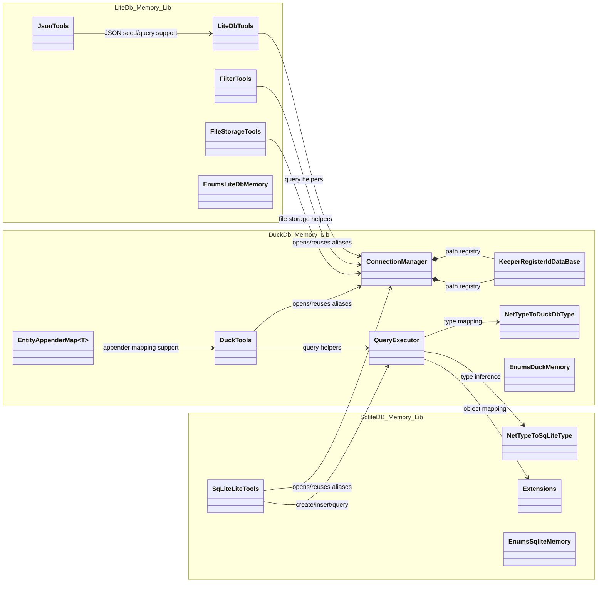
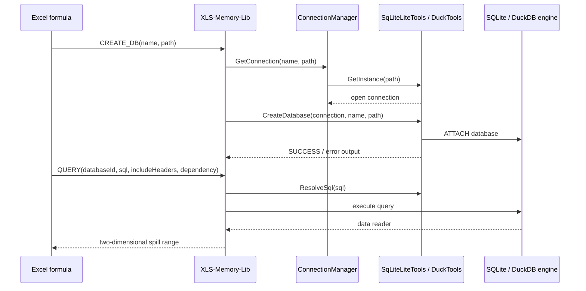

# MemoryDb-Lib Class Structure

This document maps the main projects, classes, and runtime relationships in **MemoryDb-Lib**.

## High-level package map

## Core database helper classes

## Excel add-in surface

SQLite and DuckDB worksheet functions intentionally expose matching headers for day-to-day relational work:

```mermaid
flowchart TB
    subgraph SQLite[Memory DB - SQLite]
        SCreateDb[CREATE_DB name, path]
        SAttach[ATTACH alias, databaseId, path, removeIfExist]
        SDatabases[DATABASES databaseId]
        STables[TABLES databaseId, dependency]
        SCreateTable[CREATE.TABLE databaseId, table, range, dependency]
        SInsert[INSERT databaseId, table, range, dependency]
        SExecute[EXECUTE databaseId, sql, dependency]
        SScalar[SCALAR databaseId, sql, dependency]
        SQuery[QUERY databaseId, sql, includeHeaders, dependency]
        SDrop[DROP.TABLE databaseId, table]
        SClose[CLOSE databaseId]
        SCloseAll[CLOSE.ALL]
    end

    subgraph DuckDB[Memory DB - DuckDB]
        DCreateDb[CREATE_DB name, path]
        DAttach[ATTACH alias, databaseId, path, removeIfExist]
        DDatabases[DATABASES databaseId]
        DTables[TABLES databaseId, dependency]
        DCreateTable[CREATE.TABLE databaseId, table, range, dependency]
        DInsert[INSERT databaseId, table, range, dependency]
        DExecute[EXECUTE databaseId, sql, dependency]
        DScalar[SCALAR databaseId, sql, dependency]
        DQuery[QUERY databaseId, sql, includeHeaders, dependency]
        DDrop[DROP.TABLE databaseId, table]
        DClose[CLOSE databaseId]
        DCloseAll[CLOSE.ALL]
    end

    SCreateDb -. aligned .- DCreateDb
    SAttach -. aligned .- DAttach
    SDatabases -. aligned .- DDatabases
    STables -. aligned .- DTables
    SCreateTable -. aligned .- DCreateTable
    SInsert -. aligned .- DInsert
    SExecute -. aligned .- DExecute
    SScalar -. aligned .- DScalar
    SQuery -. aligned .- DQuery
    SDrop -. aligned .- DDrop
    SClose -. aligned .- DClose
    SCloseAll -. aligned .- DCloseAll
```

## Typical execution flow

