# Class Structure

Este documento resume la estructura de clases, structs y enums del repositorio **MemoryDb-Lib**.

## Diagrama global (con colores)

```mermaid
classDiagram
    direction LR

    namespace LiteDb_Memory_Lib {
        class ConnectionManager
        class LiteDbTools
        class FilterTools
        class FileStorageTools
        class JsonTools
        class EnumsLiteDbMemory
        class OutputLiteDb
    }

    namespace SqliteDB_Memory_Lib {
        class ConnectionManagerSqlite
        class KeeperRegisterIdDataBaseSqlite
        class SqLiteLiteTools
        class QueryExecutorSqlite
        class Extensions
        class NetTypeToSqLiteType
        class EnumsSqliteMemory
        class OutputSqlite
    }

    namespace DuckDb_Memory_Lib {
        class ConnectionManagerDuck
        class KeeperRegisterIdDataBaseDuck
        class DuckTools
        class QueryExecutorDuck
        class NetTypeToDuckDbType
        class EnumsDuckMemory
        class OutputDuck
    }

    EnumsLiteDbMemory *-- OutputLiteDb
    EnumsSqliteMemory *-- OutputSqlite
    EnumsDuckMemory *-- OutputDuck

    LiteDbTools --> ConnectionManager
    FilterTools --> ConnectionManager
    FileStorageTools --> ConnectionManager

    SqLiteLiteTools --> ConnectionManagerSqlite
    SqLiteLiteTools --> QueryExecutorSqlite
    QueryExecutorSqlite --> Extensions
    SqLiteLiteTools --> NetTypeToSqLiteType
    ConnectionManagerSqlite *-- KeeperRegisterIdDataBaseSqlite

    DuckTools --> ConnectionManagerDuck
    DuckTools --> QueryExecutorDuck
    QueryExecutorDuck --> NetTypeToDuckDbType
    ConnectionManagerDuck *-- KeeperRegisterIdDataBaseDuck

    class ConnectionManager lite
    class LiteDbTools lite
    class FilterTools lite
    class FileStorageTools lite
    class JsonTools lite
    class EnumsLiteDbMemory lite
    class OutputLiteDb lite

    class ConnectionManagerSqlite sqlite
    class KeeperRegisterIdDataBaseSqlite sqlite
    class SqLiteLiteTools sqlite
    class QueryExecutorSqlite sqlite
    class Extensions sqlite
    class NetTypeToSqLiteType sqlite
    class EnumsSqliteMemory sqlite
    class OutputSqlite sqlite

    class ConnectionManagerDuck duck
    class KeeperRegisterIdDataBaseDuck duck
    class DuckTools duck
    class QueryExecutorDuck duck
    class NetTypeToDuckDbType duck
    class EnumsDuckMemory duck
    class OutputDuck duck

    classDef lite fill:#e8f5e9,stroke:#2e7d32,stroke-width:1.5px,color:#1b5e20
    classDef sqlite fill:#e3f2fd,stroke:#1565c0,stroke-width:1.5px,color:#0d47a1
    classDef duck fill:#fff3e0,stroke:#ef6c00,stroke-width:1.5px,color:#e65100
```

## Inventario por proyecto

### LiteDb-Memory-Lib

- `ConnectionManager` (sealed class)
- `LiteDbTools` (static class)
- `FilterTools` (static class)
- `FileStorageTools` (static class)
- `JsonTools` (static class)
- `EnumsLiteDbMemory` (static class)
  - `Output` (enum)

### SqliteDB-Memory-Lib

- `ConnectionManager` (sealed class)
  - `KeeperRegisterIdDataBase` (nested sealed class)
- `SqLiteLiteTools` (static partial class)
- `QueryExecutor` (static class)
- `Extensions` (static class)
- `NetTypeToSqLiteType` (static class)
- `EnumsSqliteMemory` (static class)
  - `Output` (enum)

### DuckDB-Memory-Lib

- `ConnectionManager` (sealed class)
  - `KeeperRegisterIdDataBase` (nested sealed class)
- `DuckTools` (static class)
- `QueryExecutor` (class)
- `NetTypeToDuckDbType` (static class)
- `EnumsDuckMemory` (static class)
  - `Output` (enum)

### Proyectos de pruebas

#### LiteDb-Memory-Tests
- `Connection`
- `ExecuteQueries` (+ `Ticket` struct)
- `GeneralTools` (+ `PersonalData` struct)
- `FindDocuments` (+ `MarketOrder` y `TraderEntity` structs)
- `FilesCollection`
- `InsertDocument`
- `CrossReference` (+ `Phone`, `Customer`, `Order` structs)

#### SqliteDb-Memory-Tests
- `Connection`
- `ExecuteQueries`
- `ExecuteQueriesFromFile`

#### DuckDB-Memory-Tests
- `Connection`
- `ExecuteQueries`
