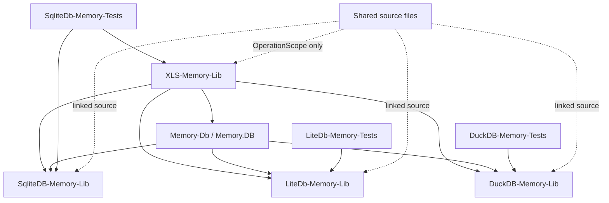
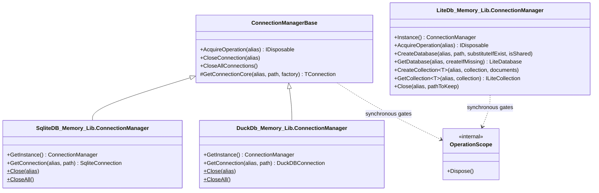
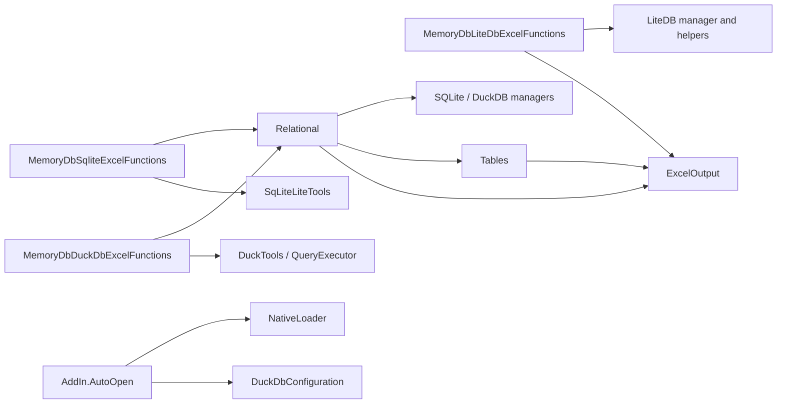

# Class structure

This document describes the current source layout of MemoryDb-Lib. Names below are C# types, not necessarily their source filenames. For setup and examples, see [README.md](README.md).

## Project dependencies

`Shared` has no `.csproj`. Linked files are compiled separately into each consuming assembly. Consequently, the relational libraries each contain their own compiled `MemoryDb_Lib.Shared.ConnectionManagerBase<TConnection>` type; this is source reuse rather than a common shared assembly. The aggregate project contains project references and packaging metadata, not a fourth database engine.

## Connection lifecycle and synchronization

The base node represents the common source implementation compiled into both relational libraries. LiteDB does not inherit it because `LiteDatabase` is not a `DbConnection`.

Relational aliases are trimmed, case-insensitive and default to `default` when blank. Existing connections are reused; changing the `path` argument for an existing alias does not replace the connection. Close the alias first to change its backing database. Failed initial opens dispose the connection before it is registered.

Alias gates survive close/reopen so waiting operations still coordinate. A scope is reentrant and uses `Monitor`; release it on the acquiring thread, do not cross `await`, and do not nest operations on different aliases. Close waits for active operations. `CloseAllConnections` closes a snapshot and aggregates disposal exceptions.

## Shared sources

| Type | Visibility | Responsibility |
| --- | --- | --- |
| [ConnectionManagerBase<TConnection>](Shared/ConnectionManagerBase.cs) | Public abstract | Relational connection registry, opening, per-alias operation gates and disposal. Constraint: `TConnection : DbConnection`. |
| [OperationScope](Shared/OperationScope.cs) | Internal sealed | Enters a monitor in its constructor and releases it on disposal. Used for aliases and raw connections. |
| [SharedFile](Shared/SharedFile.cs) | Internal static | Input streams, text readers and text loading with read/write/delete sharing. |

`ConnectionManagerBase` is linked into SQLite and DuckDB. `SharedFile` is linked into all three engine projects. `OperationScope` is linked into all three engines and the Excel project.

## LiteDB: `LiteDb_Memory_Lib`

| Type | Source | Responsibilities and main API |
| --- | --- | --- |
| `ConnectionManager` | [ConnectionManager.cs](LiteDb-Memory-Lib/ConnectionManager.cs) | Lazy singleton through `Instance()`. Creates memory databases, opens existing files, retrieves collections, imports JSON collections, checkpoints and closes databases. Owns memory streams and database instances. |
| `LiteDbTools` | [LiteDbTools.cs](LiteDb-Memory-Lib/LiteDbTools.cs) | Index creation; document updates/deletes; `Execute<T>`; materialization through `BsonDataReaderToObject<T>`. |
| `FilterTools` | [FilterTools.cs](LiteDb-Memory-Lib/FilterTools.cs) | `FindOne`, `Find`, `FindById`, `FindAll`; predicate, expression, query and include overloads. |
| `JsonTools` | [JsonTools.cs](LiteDb-Memory-Lib/JsonTools.cs) | `ReadJson<T>` and `TryReadJson<T>` using shared file access. |
| `FileStorageTools` | [FileStorageTools.cs](LiteDb-Memory-Lib/FileStorageTools.cs) | Disk/stream `Upload` overloads and `Find` for LiteDB stored files. |
| `EnumsLiteDbMemory` / nested `Output` | [EnumsLiteDbMemory.cs](LiteDb-Memory-Lib/EnumsLiteDbMemory.cs) | Status values for success, missing resources and operation failures. |

Collection/file handles are not protected after a helper returns. Keep their full use inside `AcquireOperation(alias)`. The document-list `CreateCollection<T>` overload inserts `new T()` when given no documents. File-backed creation requires an existing path; `isShared` selects LiteDB shared mode. Persistence on `Close(alias, pathToKeep)` applies to the owned in-memory stream.

## SQLite: `SqliteDB_Memory_Lib`

| Type | Source | Responsibilities and main API |
| --- | --- | --- |
| `ConnectionManager` | [ConnectionManager.cs](SqliteDB-Memory-Lib/ConnectionManager.cs) | Singleton derived from the linked relational base; factory delegates to `SqLiteLiteTools.GetInstance`. |
| `KeeperRegisterIdDataBase` | [ConnectionManager.cs](SqliteDB-Memory-Lib/ConnectionManager.cs) | Independent namespace-level type with a static, case-insensitive path-to-database-ID registry. It is not nested inside the manager. |
| `SqLiteLiteTools` | [SqLiteTools.cs](SqliteDB-Memory-Lib/SqLiteTools.cs) | Public static partial facade: create/attach/detach, table creation, CSV import/export, inserts, queries, SQL-file resolution, parameter utilities, WAL, database saving and identifier quoting. |
| `QueryExecutor` | [QueryExecutor.cs](SqliteDB-Memory-Lib/QueryExecutor.cs) | Lower-level SQL table/insert/query operations with connection-scoped locking. Readers materialize `List<Dictionary<string, object>>`. |
| `SqliteOperationResult` | [SqliteOperationResult.cs](SqliteDB-Memory-Lib/SqliteOperationResult.cs) | Readonly result struct: `Output`, `ExceptionMessage`, `IsSuccess`, equality and implicit enum conversions. `ToString()` returns the status name. |
| `NetTypeToSqLiteType` | [SqliteTypes.cs](SqliteDB-Memory-Lib/SqliteTypes.cs) | .NET-to-SQLite type mapping, string parsing and array column inference. |
| `Extensions` | [Extension.cs](SqliteDB-Memory-Lib/Extension.cs) | Array slicing/conversion and string helpers. |
| `EnumsSqliteMemory` / nested `Output` | [EnumsSqliteMemory.cs](SqliteDB-Memory-Lib/EnumsSqliteMemory.cs) | SQLite status codes, including CSV writing and table creation. `ERROR_TO_DEBUG` is an obsolete alias for `ERROR_TO_DETACH_DATABASE`. |

The actual facade name is `SqLiteLiteTools`, even though the file is named `SqLiteTools.cs`. The facade often captures exceptions in operation results; lower-level executor methods can throw. Callers should inspect results and handle exceptions according to the selected overload.

## DuckDB: `DuckDb_Memory_Lib`

| Type | Source | Responsibilities and main API |
| --- | --- | --- |
| `ConnectionManager` | [ConnectionManager.cs](DuckDB-Memory-Lib/ConnectionManager.cs) | Singleton derived from the linked relational base; factory delegates to `DuckTools.GetInstance`. |
| `KeeperRegisterIdDataBase` | [ConnectionManager.cs](DuckDB-Memory-Lib/ConnectionManager.cs) | Namespace-level static registry API for file paths and catalog IDs, separate from SQLite's registry. |
| `DuckTools` | [DuckTools.cs](DuckDB-Memory-Lib/DuckTools.cs) | Connection creation/configuration, attached databases, database/table listing, drop/detach, scalar functions, SQL-file resolution and quoting. |
| `QueryExecutor` | [QueryExecutor.cs](DuckDB-Memory-Lib/QueryExecutor.cs) | Typed table definitions, Parquet table replacement and parameterized readers returning status plus materialized dictionary rows. |
| `DuckDbConfiguration` | [DuckDbConfiguration.cs](DuckDB-Memory-Lib/DuckDbConfiguration.cs) | Loads `memory-db.json`; exposes `Current`, `Initialize`, `Load`, `TempPath` and `ExtensionPath`; applies settings to new connections. |
| `DuckOperationResult` | [DuckOperationResult.cs](DuckDB-Memory-Lib/DuckOperationResult.cs) | Readonly result struct with status, optional exception message, success flag, enum conversions and equality. |
| `NetTypeToDuckDbType` | [DuckTypes.cs](DuckDB-Memory-Lib/DuckTypes.cs) | Maps CLR types to `DuckDBType` and parses string values. |
| `EntityAppenderMap<T>` | [DuckDbMappings.cs](DuckDB-Memory-Lib/DuckDbMappings.cs) | Abstract extension point derived from the provider's `DuckDBAppenderMap<T>`. |
| `EnumsDuckMemory` / nested `Output` | [EnumsDuckMemory.cs](DuckDB-Memory-Lib/EnumsDuckMemory.cs) | Engine operation statuses. |

Parameter keys in DuckDB readers are normalized by removing leading `@`, `$` or `:`. Connection factories apply the current configuration once and allocate a unique temporary subdirectory. Configuration changes do not mutate already-open connections.

## Excel: `XLS_Memory_Lib`

| Type | Source | Responsibility |
| --- | --- | --- |
| `AddIn` | [NativeLoader.cs](XLS-Memory-Lib/NativeLoader.cs) | Implements `IExcelAddIn`; `AutoOpen` initializes native lookup and DuckDB paths. `AutoClose` is empty. |
| `NativeLoader` | [NativeLoader.cs](XLS-Memory-Lib/NativeLoader.cs) | Internal helper calling Windows `SetDllDirectory` for the add-in's `native/x64` directory. |
| `MemoryDbExcelAddIn` | [MemoryDbExcelAddIn.cs](XLS-Memory-Lib/MemoryDbExcelAddIn.cs) | Registers the assembly-version worksheet function. |
| `GeneralFunctionalities` | [GeneralFunctionalities.cs](XLS-Memory-Lib/GeneralFunctionalities.cs) | Add-in directory and native-path worksheet functions. `NativePath` uses `AppContext.BaseDirectory`, whereas the native loader uses the `.xll` directory. |
| `MemoryDbLiteDbExcelFunctions` | [LiteDbExcelFunctions.cs](XLS-Memory-Lib/LiteDbExcelFunctions.cs) | LiteDB worksheet adapters. |
| `MemoryDbSqliteExcelFunctions` | [SqliteExcelFunctions.cs](XLS-Memory-Lib/SqliteExcelFunctions.cs) | SQLite worksheet adapters, including CSV query export. |
| `MemoryDbDuckDbExcelFunctions` | [DuckDbExcelFunctions.cs](XLS-Memory-Lib/DuckDbExcelFunctions.cs) | DuckDB worksheet adapters, including Parquet import. |
| `Relational` | [RelationalExcelDbHelpers.cs](XLS-Memory-Lib/RelationalExcelDbHelpers.cs) | Internal shared SQL adapter, parameters, raw commands, table creation and insertion. |
| `Tables` | [ExcelTableHelpers.cs](XLS-Memory-Lib/ExcelTableHelpers.cs) | Internal range/header validation, input normalization, reader-to-array conversion and spill errors. |
| `ExcelOutput` | [ExcelOutput.cs](XLS-Memory-Lib/ExcelOutput.cs) | Normalizes enum/result success and error text for worksheet consumers. |

Input tables require a header row and at least one data row. Empty headers are rejected. Empty/missing/error Excel cells and empty strings normalize to `DBNull.Value`; database nulls become `ExcelEmpty.Value` on output.

Most database functions declare `IsThreadSafe = true`. This allows concurrent Excel scheduling but does not order creation, insertion and queries: dependency arguments must reference the cells that perform preceding work. Not every wrapper catches every exception; do not assume a universal no-throw contract. `QUERY_TO_CSV` returns the operation status string rather than passing it through `ExcelOutput`.

## Worksheet function signatures

The following inventory is extracted from the current `[ExcelFunction]` attributes and C# method declarations. Argument names are listed in implementation order; `?` denotes C# nullability, not an Excel optional argument. Only explicit `= ...` values are C# defaults. General functions have no engine prefix beyond `MEMORY_DB.`.

### DuckDbExcelFunctions

| Worksheet name | C# arguments | Returns |
| --- | --- | --- |
| `MEMORY_DB.DUCKDB.CREATE_DB` | `string name, string path` | `string` |
| `MEMORY_DB.DUCKDB.ATTACH` | `string alias, string databaseId, string path = "", bool removeIfExist = false` | `string` |
| `MEMORY_DB.DUCKDB.DATABASES` | `string databaseId` | `object[,]` |
| `MEMORY_DB.DUCKDB.TABLES` | `string databaseId, object dependency` | `object[,]` |
| `MEMORY_DB.DUCKDB.CREATE.TABLE` | `string databaseId, string table, object[,] range, object dependency` | `string` |
| `MEMORY_DB.DUCKDB.CREATE.PARQUET.TABLE` | `string databaseId, string table, string parquetPath, object dependency` | `string` |
| `MEMORY_DB.DUCKDB.INSERT` | `string databaseId, string table, object[,] range, object dependency` | `string` |
| `MEMORY_DB.DUCKDB.EXECUTE` | `string databaseId, string sql, object dependency` | `string` |
| `MEMORY_DB.DUCKDB.SCALAR` | `string databaseId, string sql, object dependency` | `object` |
| `MEMORY_DB.DUCKDB.QUERY` | `string databaseId, string sql, bool includeHeaders, object[,] parameters, object dependency` | `object[,]` |
| `MEMORY_DB.DUCKDB.DROP.TABLE` | `string databaseId, string table` | `string?` |
| `MEMORY_DB.DUCKDB.CLOSE` | `string databaseId` | `string` |
| `MEMORY_DB.DUCKDB.CLOSE.ALL` | `(none)` | `string` |

### GeneralFunctionalities

| Worksheet name | C# arguments | Returns |
| --- | --- | --- |
| `MEMORY_DB.PATH` | `(none)` | `string` |
| `MEMORY_DB.NATIVE.PATH` | `(none)` | `string` |

### LiteDbExcelFunctions

| Worksheet name | C# arguments | Returns |
| --- | --- | --- |
| `MEMORY_DB.LITEDB.CREATE` | `string alias, string path = "", bool replaceExisting = true, bool shared = false` | `string` |
| `MEMORY_DB.LITEDB.CLOSE` | `string alias, string pathToKeep = ""` | `string` |
| `MEMORY_DB.LITEDB.COLLECTIONS` | `string alias` | `object[,]` |
| `MEMORY_DB.LITEDB.INSERT.JSON` | `string alias, string collection, string jsonDocument` | `string` |
| `MEMORY_DB.LITEDB.FINDALL.JSON` | `string alias, string collection` | `object[,]` |
| `MEMORY_DB.LITEDB.DELETE` | `string alias, string collection, string id` | `string` |

### MemoryDbExcelAddIn

| Worksheet name | C# arguments | Returns |
| --- | --- | --- |
| `MEMORY_DB.VERSION` | `(none)` | `string` |

### SqliteExcelFunctions

| Worksheet name | C# arguments | Returns |
| --- | --- | --- |
| `MEMORY_DB.SQLITE.CREATE_DB` | `string name, string path` | `string` |
| `MEMORY_DB.SQLITE.ATTACH` | `string alias, string databaseId, string path = "", bool removeIfExist = false` | `string` |
| `MEMORY_DB.SQLITE.DATABASES` | `string databaseId` | `object[,]` |
| `MEMORY_DB.SQLITE.TABLES` | `string databaseId, object dependency` | `object[,]` |
| `MEMORY_DB.SQLITE.CREATE.TABLE` | `string databaseId, string table, object[,] range, string path, object dependency` | `string` |
| `MEMORY_DB.SQLITE.INSERT` | `string databaseId, string table, object[,] range, object dependency` | `string` |
| `MEMORY_DB.SQLITE.EXECUTE` | `string databaseId, string sql, object[,]? parameters, object? dependency` | `string` |
| `MEMORY_DB.SQLITE.SCALAR` | `string databaseId, string sql, object dependency` | `object` |
| `MEMORY_DB.SQLITE.QUERY` | `string databaseId, string sql, bool includeHeaders, object[,]? parameters, object? dependency` | `object[,]` |
| `MEMORY_DB.SQLITE.QUERY_TO_CSV` | `string databaseId, string sql, bool includeHeaders, object[,]? parameters, string pathToSave, object? dependency` | `object` |
| `MEMORY_DB.SQLITE.DROP.TABLE` | `string databaseId, string table` | `string?` |
| `MEMORY_DB.SQLITE.SAVE` | `string databaseId, string path` | `string` |
| `MEMORY_DB.SQLITE.CLOSE` | `string databaseId` | `string` |
| `MEMORY_DB.SQLITE.CLOSE.ALL` | `(none)` | `string` |

## Test organization

- `LiteDb-Memory-Tests`: connections, inserts, filters, references/includes, queries, stored files, JSON/shared files and concurrent access.
- `SqliteDb-Memory-Tests`: connections, SQL text/files, parameter binding, imports, local database files, SQLite concurrency and selected SQLite/DuckDB Excel wrappers. It references the Excel project in addition to SQLite.
- `DuckDB-Memory-Tests`: connections, queries, table utilities, local files/Parquet, path configuration and concurrent operations.

These are NUnit projects. Test data files are copied to output where declared in their project files. The documentation records coverage areas, not a claim that every behavior is tested or that the suite has been run as part of this documentation update.
